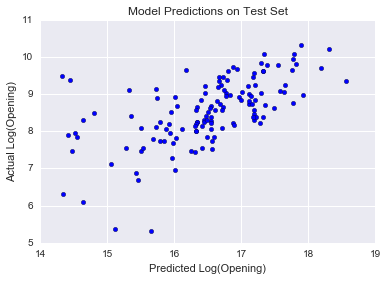

### Project Luther: Predicting Opening Weekend Revenue for Movies

## Client

My hypothetical client would be one of the major theatre chains in the United States (suchas AMC, Cinemark or Regal).  
By projecting the opening weekend revenue of movies being released, the theatres would be able to effectively manage both  
their employee and concession resources. This could also be used to optimize screening times and number of screens per move  
(depending on the deal with the distributor).

## Data

I gathered the top 200 movies by opening revenue from Box Office Mojo. This source also gave me information on the number of  
theatres a movie was released in in its opening weekend, as well as the release date.

I also gathered extra data on these movies from OMDB. This gave me information on the actors in a movie, the runtime and genre.  

In order to determine some measure of "hype" about particular movies, I scraped data from The Pirate Bay to see how many torrents  
for a movie were posted before its release date.

## Scope

I filtered out any movie that was released to less than 500 theatres, because my hypothetical clients generally only show major  
motion picture releases. This left me with 696 movies with which to build the model. 

## Results 

First I decided to predict the log of the opening weekend numbers, as large releases tend to do significantly better than average.  
I then looked at the relationship between number of opening theatres and opening and found that to be significant. 
I then looked into adding number of critical reviews on Metascore before a movie was released, but found that number to not correlate well  
with opening weekend numbers, as critics tend to review small and terrible movies just as often as major releases. This is likely due to the fact  
that Metascore is selective with who they use to form their scores, and that would require the critic to have a large sample size of reviews to draw from.
I then added a dummy variable for whether the movie was released in June or December, as those are generally two of the highest grossing months in theatres. So instead of number of reviews, I went with the actual Metascore for a movie based on all reviews that came out before it was released.
Finally, I added the number of torrents released for a particular title before or on its release date. 

These 5 variables were then run on 80% of the data to train, and found an adjusted R^2 value of 0.688.

Here's a histogram of the residuals, showing them to be normally distributed:

And when run on the test set:  

